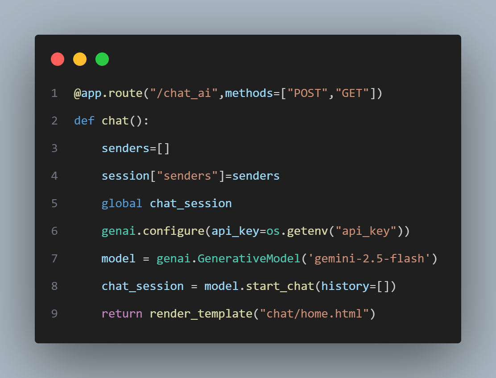
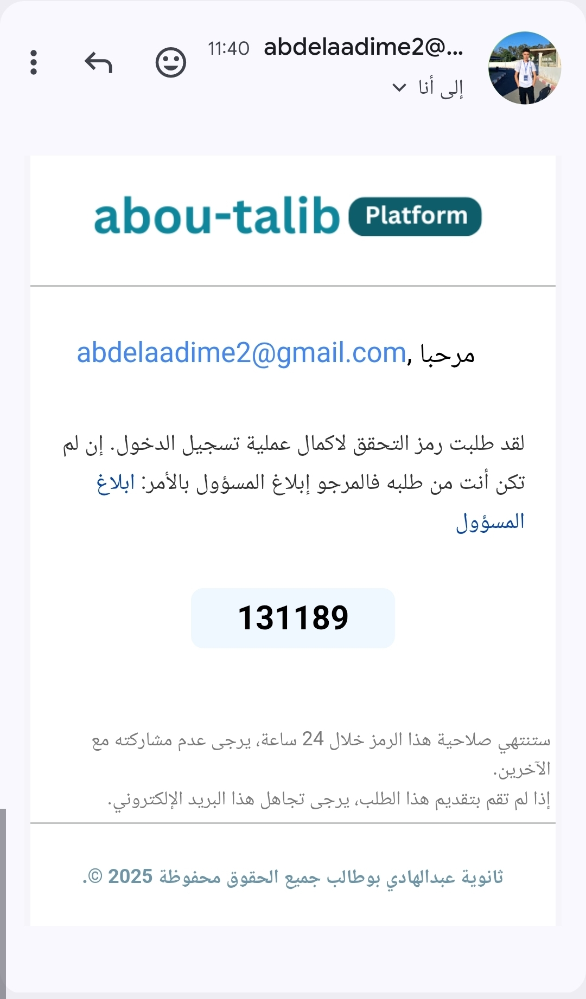
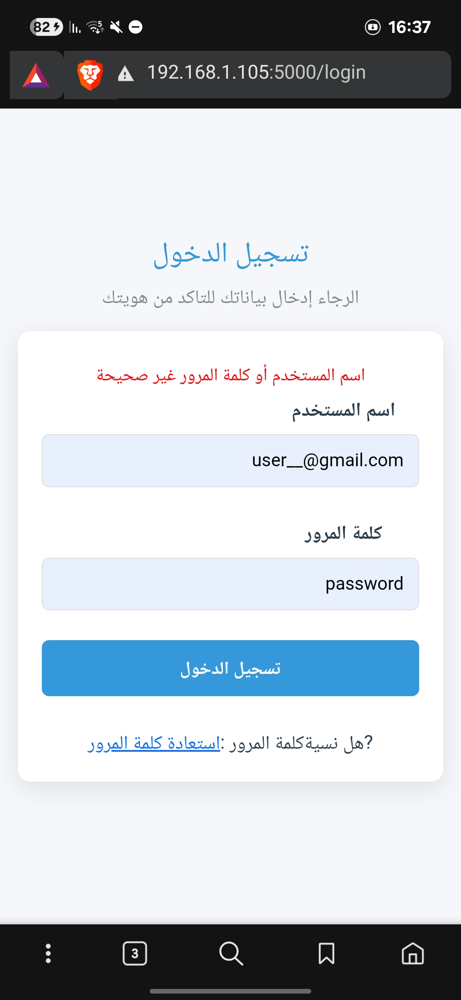
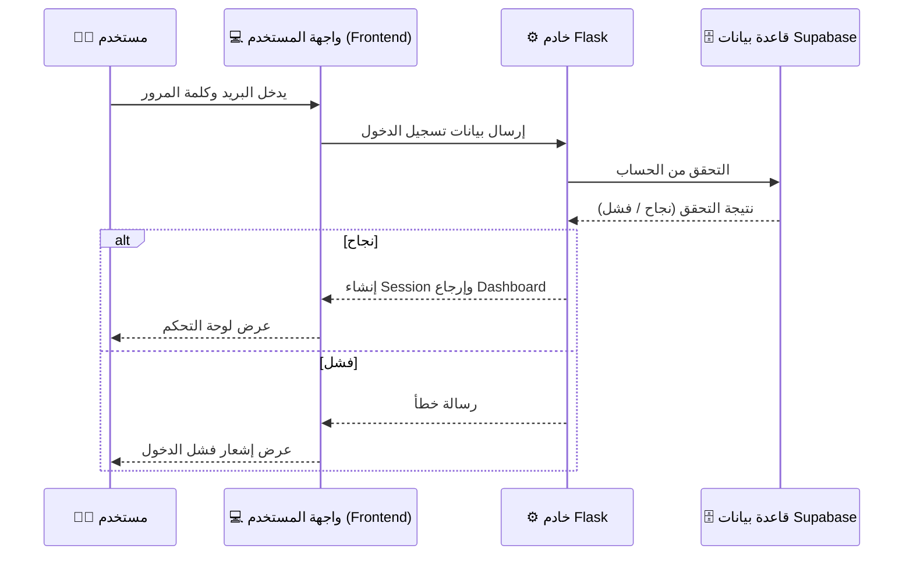
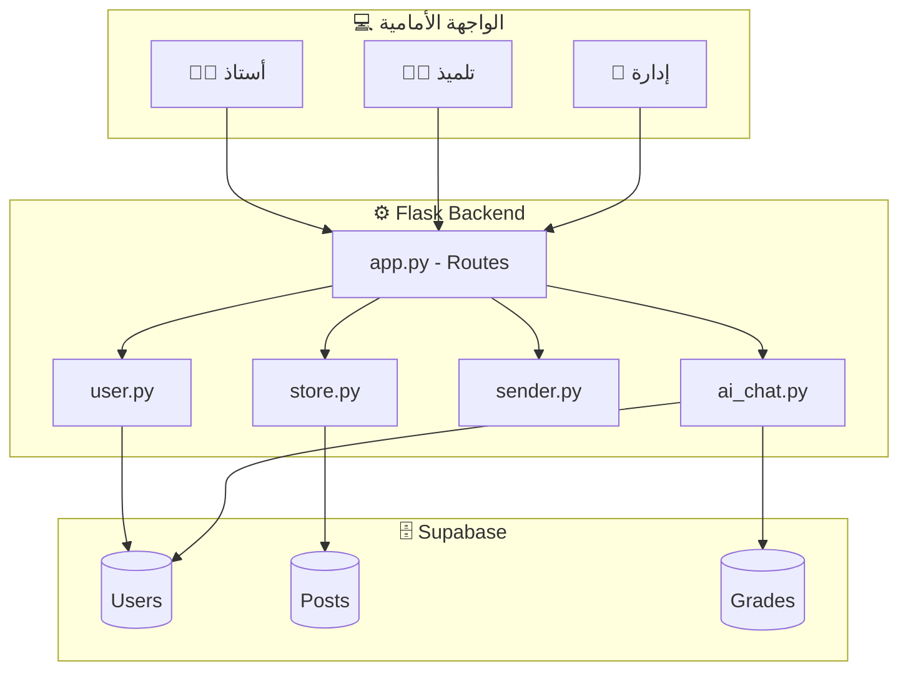
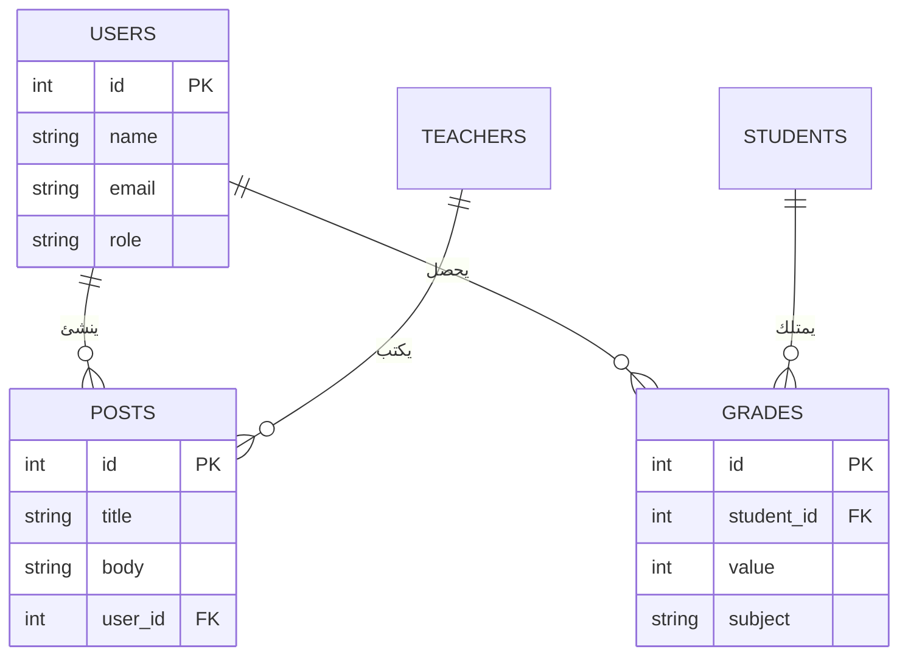

# 🏫 School Portal Project


موقع تعليمي متكامل لإدارة المدرسة، يسمح للمدرسين والإدارة بالتواصل مع التلاميذ، ونشر المنشورات، ومتابعة الحسابات الشخصية، وحساب المعدلات. كما يدمج نموذج ذكاء اصطناعي للإجابة على الأسئلة، ويدعم **PWA** للوصول السريع عبر الهواتف.

---

## 🔹 ميزات المشروع

- إضافة منشورات جديدة للإدارة والأساتذة.  
- صفحات عرض المنشورات والبروفايلات الشخصية للأساتذة.  
- تسجيل دخول مع خيار استرجاع كلمة المرور عبر البريد الإلكتروني.  
- نموذج ذكاء اصطناعي للإجابة على الأسئلة بناءً على قاعدة البيانات.  
- حساب المعدلات الأكاديمية للتلاميذ تلقائيًا.  
- إمكانية التواصل بين التلاميذ والإدارة.  
- دعم **PWA** لتثبيت التطبيق على الهواتف.  
- إدارة الصلاحيات لكل نوع مستخدم (أستاذ، إدارة، تلميذ).

---

## 🏗️ الهيكلية العامة

- **Front-end:** HTML / CSS / JavaScript  
- **Back-end:** Python + Flask  
- **قاعدة البيانات:** Supabase  
- **الأمان:** حماية الصفحات الحساسة، إدارة الصلاحيات  

---

## ⚡ المتطلبات

- Python 3.10+  
- pip  
- Git  

---

## 🚀 التثبيت والتشغيل

1. استنساخ المستودع:
```bash
git clone https://github.com/lahrour88/abou-talib.git
cd abou-talib
```

2. تثبيت المتطلبات:
```bash
pip install -r requirements.txt
```

3. تشغيل المشروع:
```bash
python app.py
```

4. الوصول إلى التطبيق عبر المتصفح:
```
http://localhost:5000
```

---

## 🤖 استخدام الذكاء الاصطناعي

يمكن للمستخدمين طرح أسئلة على النظام وسيجيب نموذج الذكاء الاصطناعي بناءً على البيانات الموجودة في قاعدة البيانات.

---

## 👨‍💻 المساهمة

مرحب بالمطورين لإضافة ميزات جديدة أو تحسين الأداء.  
- افتح Issue لوصف المشكلة أو الاقتراح.  
- قدم Pull Request مع وصف التعديلات.  

---

## 📸 صور توضيحية

  
  
  

---

## 🛠️ الفريق والمطور

  
**المطور:** lahrour abdelaadime

[رابط GitHub](https://github.com/lahrour88)  
[رابط Instagram](https://instagram.com/lahrour_1902)    

---

## 🔗 روابط الموقع على Vercel
[abou-talib.vercel.app](https://abou-talib.vercel.app)  

---

## 🗂️ المخططات التوضيحية

### 🔐 تدفق تسجيل الدخول


---

### ⚙️ بنية المشروع


---

### 🧩 العلاقات بين الجداول

